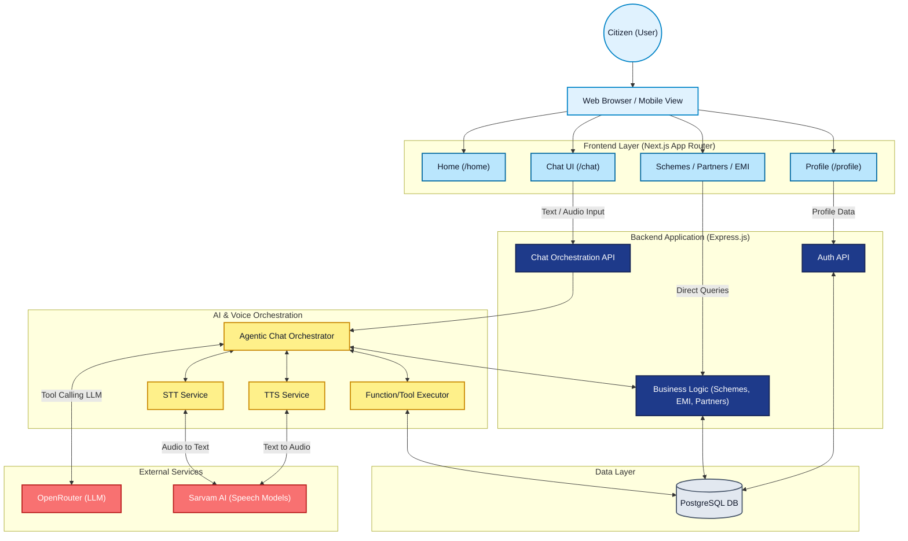
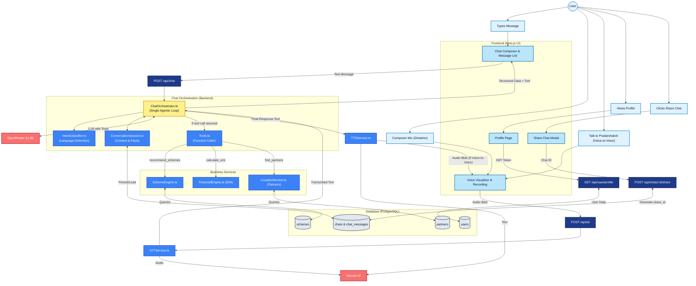

# PradarshakAI System Architecture

This document describes the end-to-end architecture of the PradarshakAI platform, derived from an analysis of the actual implementation. It covers the major subsystems, data flows, client-server boundaries, and external dependencies.

---

## 1. High-Level System Architecture

This diagram illustrates the macro-level relationships between the Citizen, the Next.js Frontend, the Express.js Backend, internal AI/Voice orchestration, the database, and external API providers.

---

## 2. Detailed End-to-End Application Flow

This detailed diagram breaks down the specific workflows for Text Chat, Voice Input, Conversation Orchestration, Scheme Recommendation, Shared Chats, and Profile logic.

---

## 3. Architecture Notes

Based on a deep inspection of the source code, the system operates with the following confirmed architecture:

### A. Technology Stack
- **Frontend Framework:** Next.js (App Router, React 19)
- **Styling:** Tailwind CSS (v4)
- **Backend Framework:** Express.js (TypeScript)
- **Database:** PostgreSQL (accessed via raw SQL queries in `src/db/pool.ts` without an ORM)
- **Authentication:** Custom JWT-based authentication with bcrypt for password hashing.
- **LLM Provider:** OpenRouter API (`openrouter.ts`), utilizing tool-calling models.
- **Speech Services:** Sarvam AI API (used directly for both Speech-to-Text and Text-to-Speech via REST).

### B. Main Data Flows

**1. Text Chat Pipeline**
`User` -> `Chat Composer (Frontend)` -> `POST /api/chat` -> `ChatOrchestrator` -> Loads past messages (`ConversationSession`) -> Identifies language (`IntentClassifier`) -> Calls LLM via OpenRouter.
The LLM can optionally invoke tools defined in `Tools.ts`. If it does, the Orchestrator executes deterministic backend functions (e.g., querying the PostgreSQL database for schemes), returns the JSON results to the LLM, and the LLM produces a grounded natural-language response. Both the raw text and structured tool data are sent back to the Next.js UI and stored in the database.

**2. Voice Pipeline (Two Modes)**
- **Composer Mic (Speech-to-Text):** The user clicks the small microphone icon in the chatbox. The browser records audio and POSTs it to `/api/stt`. The backend sends this buffer to Sarvam AI. The resulting transcript is populated into the text composer for the user to edit and send.
- **"Talk to PradarshakAI" (Voice-to-Voice):** A continuous voice session. Audio is captured, transcribed via Sarvam STT, processed by the same `ChatOrchestrator`, and the text response is sent to `/api/tts` (Sarvam TTS). The audio blob is returned to the frontend and played back automatically.

**3. Scheme Recommendation Architecture**
The system guarantees grounded recommendations by enforcing a strict split: The LLM *understands* the user but *cannot invent* schemes. The LLM triggers the `recommend_schemes` tool. `SchemeEngine.ts` executes raw SQL against the `schemes` table. The exact matching schemes are returned, and the LLM forms a response based *only* on that data. The frontend renders structured `SchemeCard` components using the attached JSON metadata, not just the LLM's text.

**4. Share Chat Flow**
Authenticated users can "Share" a chat. The backend (`chats.ts`) generates a unique `share_id` (e.g., `sh_123xyz`) and updates the `chats` table. A public endpoint `/api/chats/share/:id` allows unauthenticated access to read-only conversation history, fully reconstructing the structured scheme cards for viewers.

### C. Major Application Layers

1. **Client / Browser:** Handles state management, microphone permissions, MediaRecorder APIs, and rendering of structured Markdown/Cards.
2. **Next.js Server:** Primarily serves the React frontend, though it also contains configuration routing.
3. **Express.js API:** The core business layer handling authentication, token validation, and orchestration logic.
4. **AI/Voice Layer:** Specialized services (`STTService`, `TTSService`, `ChatOrchestrator`) that wrap external API calls.
5. **Data Layer:** PostgreSQL database with structured tables (`users`, `chats`, `chat_messages`, `schemes`, `partners`).

### D. Authentication Model
Users register via `userAuth.ts`. Registration can involve OTPs (`OtpService.ts`) and email verification (`EmailService.ts` via Nodemailer). Once authenticated, the server issues a standard JWT. The frontend stores this token and includes it in the `Authorization` header for protected routes (`/api/chat`, `/api/user/profile`, `/api/chats`).

---

## 4. Architecture Observations

While analyzing the codebase, several architectural patterns and observations were noted:

### Strengths & Good Patterns
- **Agentic Tool-Calling:** Merging intent classification and execution into a single "agentic loop" in `ChatOrchestrator.ts` heavily simplifies the backend. It cleanly prevents the LLM from hallucinating scheme data by forcing it to summarize deterministic database queries.
- **Raw SQL over ORM:** The project relies on raw PostgreSQL queries. While verbose, this provides absolute control over indexing and performance, avoiding the "N+1" query problems common in complex recommendation queries.
- **Client/Server Boundary:** There is a very strict and clean boundary between the Next.js frontend (UI only) and the Express.js backend (Business Logic + DB).

### Potential Risks & Considerations
- **LLM Latency Dependency:** Because the Voice-to-Voice flow relies on STT -> LLM (OpenRouter) -> TTS serially, total latency is cumulative. If OpenRouter or Sarvam experience delays, the voice conversation will feel sluggish. There doesn't appear to be aggressive streaming TTS implementation to mask LLM generation time.
- **Voice Interruption (Barge-In):** The implementation appears to be standard request/response for voice. Implementing true continuous VAD (Voice Activity Detection) with interruption (barge-in) over a REST architecture is fundamentally difficult compared to WebSockets or WebRTC.
- **Database Migrations:** Migrations are handled via standalone TypeScript scripts (`migrate-v2.ts`, `migrate-v3.ts`, etc.). As the schema grows, managing state across environments may become brittle without a formal migration runner (e.g., Flyway, Prisma Migrate, or Drizzle).
